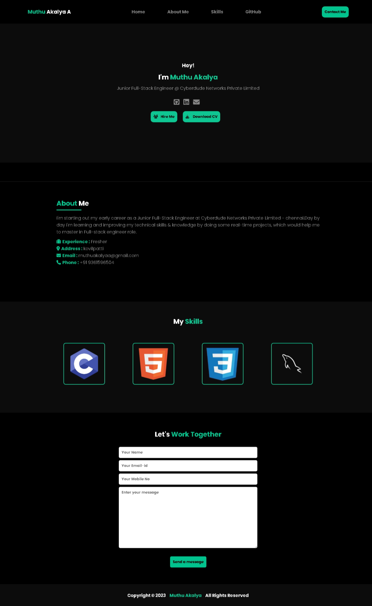

# Project Title

This is the #2 Project of mine which is a " Responsive Web Portfolio Using HTML and CSS " under the "**Full Stack Engineering Internship program**" by [CyberDude Networks Pvt. Ltd.](https://cyberdudenetworks.com).

## Table of Contents

- [Project Title](#project-title)
  - [Table of Contents](#table-of-contents)
  - [Description](#description)
  - [Demo](#demo)
  - [Internship](#internship)
  - [Technologies Used](#technologies-used)
  - [Features](#features)
  - [Installation](#installation)
    - [How to Setup the Project Locally?](#how-to-setup-the-project-locally)
  - [Contributing](#contributing)
    - [How to Contribute](#how-to-contribute)
  - [License](#license)
  - [Acknowledgments](#acknowledgments)

## Description

This project was assigned by the [CyberDude Networks Pvt. Ltd.](https://cyberdudenetworks.com). In this project, I designed and developed a responsive web portfolio using HTML and CSS. The primary goal of this project was to create a visually appealing and user-friendly online portfolio that adapts seamlessly to various devices, including tablets and large-screen smartphones.

## Demo

🌟🌟 Project Live URL: https://muthuakalya.github.io/MuthuAkalyaA-Portfolio/

## Internship

This internship is provided by [CyberDude Networks Pvt. Ltd.](https://youtube.com/cyberdudenetworks) as part of the 6-Month Free Internship program, a skill development initiative organized to enhance participants' skills. Mentoring was provided by [Mr. Anbuselvan Rocky](https://instagram.com/anbuselvanrocky). For more information, [you can contact CyberDude Networks here](https://cyberdudenetworks.com).

## Technologies Used

**For Frontend** - HTML 5, CSS 3

## Features

- Mobile Responsiveness
- Clean and attractive design
- User interaction

## Installation

Installation is pretty simple that don't require large dependencies since this project is built on top with HTML, CSS without any frameworks and pre-processors. Please check below setting up the project locally.

### How to Setup the Project Locally?

Check the repository - [My Resume](https://github.com/MUTHUAKALYA/MuthuAkalyaA-Portfolio), Go to "Local Tab" and download ZIP as your method to download this project to local. Afterwards, Open it with your code editor then use "**Live Server**" or **Right click** on the Index.html file and Open with your favorite browser.

## Contributing

If you want to contribute to this project and make it better, Your help is very welcome. Contributing also helps you to elevate your social coding skill to pinnacle and will be able to work with many other skillful devs at ease.

### How to Contribute

- Fork the Repository [here](https://github.com/MUTHUAKALYA/MuthuAkalyaA-Portfolio).
- Once you Successfully forked to your local machine, then make sure to open up with your editor.
- Before you browse the code, Always check with Issues / Pull Request tab and be concious with already open requests until now, and do not duplicate it.
- Browse the code, and find bug or feature.
- If you find a bug or feature, don't hesitate to create a branch and initiate a PR with your changes.

## License

MIT

## Acknowledgments

[Anbu Selvan Rocky](https://www.instagram.com/anbuselvanrocky/) is one of our mentor in the CyberDude's internship program, and helped me with direction that I wanted to go. the knowledge passed down from Anbu is massive. Thanks for your dedication.
